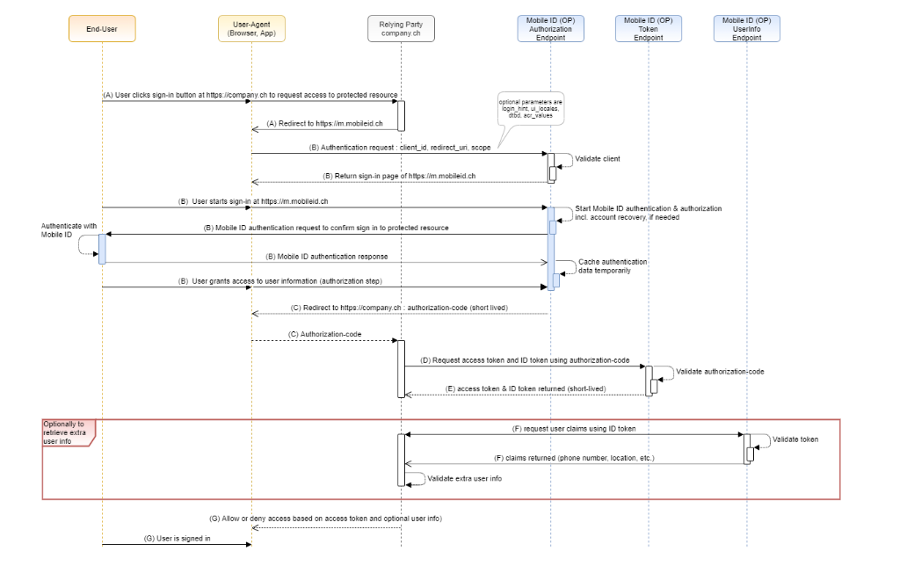

Introduction
=====

This document provides Relying Parties (RPs) with technical guidance and best practices for integrating Mobile
ID Open ID Provider (MobileID OP) into their applications.

.. note:: This is an info box indicating additional information or a note to the reader.

   You can include multiple lines of text here. The content should be indented consistently to form part of the note.

.. OpenID:: The MobileID OP can be used for both authorization and authentication. 
   It fully complies with the OpenID Connect specification.
   
   OpenID Connect is a simple identity layer on top of the OAuth 2.0 protocol. It allows clients to verify the
   identity of the End-User based on the authentication performed by an Authorization Server, as well as to
   obtain basic profile information about the End-User in an interoperable and REST-like manner.

   OpenID Connect allows clients of all types, including Web-based, mobile, and JavaScript clients, to re-
   quest and receive information about authenticated sessions and end-users. The specification suite is ex-
   tensible, allowing participants to use optional features such as encryption of identity data, discovery of
   OpenID Providers, and session management, when it makes sense for them.
   See https://openid.net/connect/faq/ for a set of answers to Frequently Asked Questions.
   The Mobile ID solution protects access to your company data and app.

.. _Basic Key Concepts - Terminology:

Basic Key Concepts - Terminology
------------

The most basic key concepts are as follows.

- **End-User** is the entity that wants to assert a particular identity, the Mobile ID User (a human being).

- **User-Agent** is the program (such as a browser) used by the End-User to communicate with the Relying
  Party and OpenID Connect Provider.

- **Relying Party (RP)** is our customer's web site or client application that wants to verify the End-User's
  identifier. It outsources its user authentication function to an OpenID Connect Provider. It can request
  claims (e.g., user information) about that End-User.

- **OpenID Connect Provider (OP)** is an authorization server that offers authentication as a service and
  provides claims to a Relying Party about the authentication event and the End-User.

- **Scopes** are identifiers used to specify what access privileges are being requested.

- **Claims** are simply key & value pairs that contain information about an End-User, as well as meta-information
  about the authentication event. Non-standard claims can be specified as custom claims.

- **Access Token** are credentials used to access protected resources directly. Access tokens usually have
  an expiration date and are short-lived. They must be kept secret, though security considerations are
  less strict due to their shorter life.

- **ID Token** is an identity token provided by the OpenID Provider to the Relying Party. The identity
  token contains a number of claims about that End-User and also attributes about the End-User authentication
  event, in a standard JWT format and signed by the OpenID Provider (so it can be verified by the intended
  recipients). It may optionally be encrypted for confidentiality.

- **Refresh Token** carries the information necessary to get a new access token. Refresh tokens can also
  expire but are rather long-lived.

Authorization Code Grant Flow
----------------
Mobile ID utilizes the Authorization Code Grant Type to obtain an access token to grant application to retrieve
user data after authenticating. The Authorization Code Flow, in abstract, follows the following steps:

